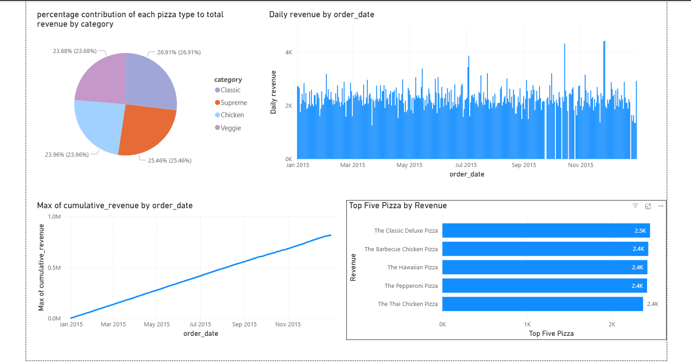

# 🍕 Pizza Sales Analysis

## 📊 Tools Used
- MySQL
- Power BI

## 📈 Key Insights
- Calculate the percentage contribution of each pizza type to total revenue.
- Analyze the cumulative revenue generated over time.
- Determine the top 3 most ordered pizza types based on revenue for each pizza category.
- Join the necessary tables to find the total quantity of each pizza category ordered.
- Determine the distribution of orders by hour of the day.
- Join relevant tables to find the category-wise distribution of pizzas.
- Group the orders by date and calculate the average number of pizzas ordered per day.

## 📷 Dashboard Preview

